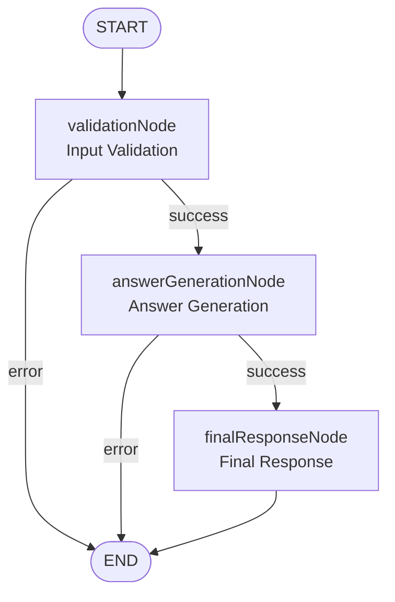

# LangGraph Chat Workflow

A **LangGraph implementation** for processing chat messages in the LIAM application, providing structured workflow management.

## Architecture



## Workflow State

```typescript
interface WorkflowState {
  mode?: 'Ask' | 'Build'
  userInput: string
  generatedAnswer?: string
  finalResponse?: string
  history: string[]
  schemaData?: Schema
  projectId?: string
  error?: string
  // Additional processing fields
  schemaText?: string
  formattedChatHistory?: string
  agentName?: string
}
```

## Key Features

- **Conditional Routing**: Smart error handling with dynamic routing based on state
- **State Management**: Type-safe state transitions with LangGraph's annotation system
- **Error Handling**: Structured error handling with graceful failure paths

## Nodes

1. **validationNode**: Validates inputs (mode, schemaData, projectId) and prepares workflow state for agent execution
2. **answerGenerationNode**: Selects the appropriate Mastra agent based on mode ('Ask' or 'Build') and generates a response
3. **finalResponseNode**: Takes the generated answer, formats it as the final response, and updates chat history

## Usage

```typescript
import { executeChatWorkflow } from './workflow'

const result = await executeChatWorkflow({
  mode: 'Ask',
  userInput: 'What is the users table structure?',
  history: [],
  schemaData: mySchemaData,
  projectId: 'my-project-id',
})
```

This workflow provides a structured approach to chat processing while maintaining compatibility with the existing LIAM codebase.
