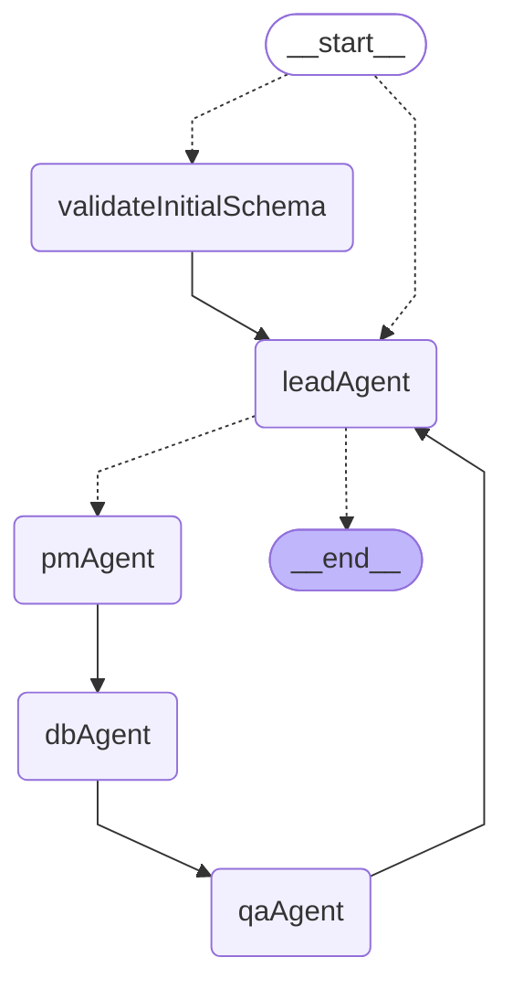
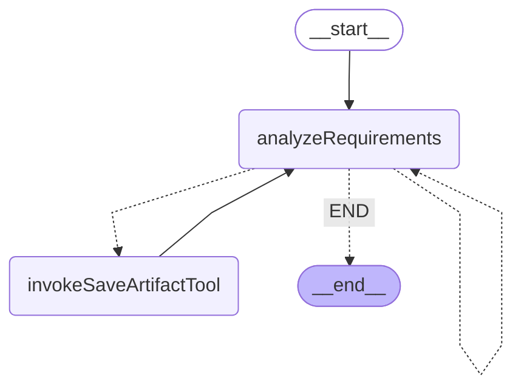
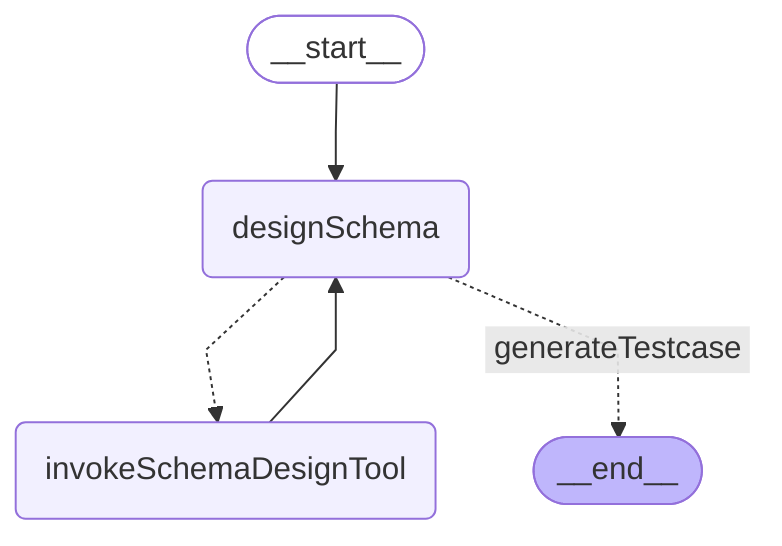
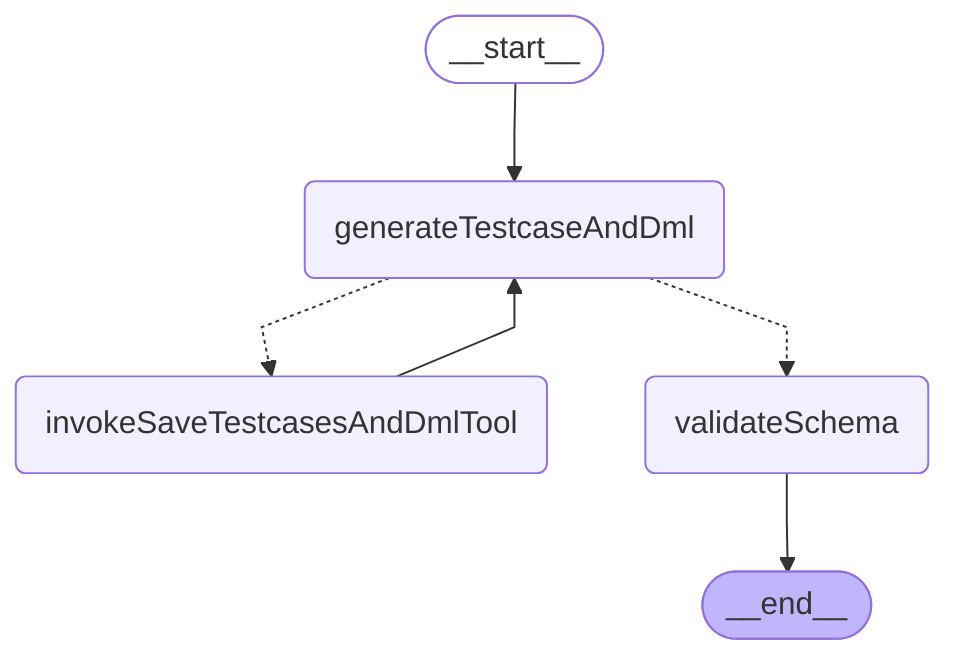

# LangGraph Chat Workflow

A **LangGraph implementation** for processing chat messages in the LIAM application, providing structured workflow management.

## Architecture



## Workflow State

```typescript
interface WorkflowState {
  userInput: string;
  messages: BaseMessage[];
  schemaData: Schema;
  error?: Error;
  buildingSchemaId: string;
  latestVersionNumber: number;
  organizationId: string;
  userId: string;
  designSessionId: string;

  // Requirements analysis
  analyzedRequirements?: AnalyzedRequirements;
  testcases: Testcase[];

  // DML execution results
  dmlExecutionErrors?: string;
}
```

## Key Features

- **Conditional Routing**: Smart error handling with dynamic routing based on state
- **State Management**: Type-safe state transitions with LangGraph's annotation system
- **Error Handling**: Structured error handling with graceful failure paths
- **Retry Policy**: All nodes are configured with retry policy (maxAttempts: 3)
- **Fallback Mechanism**: Automatic fallback to finalizeArtifacts on critical errors
- **Real-time Progress Tracking**: Users can view AI responses in real-time during workflow execution
- **Optimized Memory Usage**: No intermediate state storage for generated responses

## Nodes

0. **validateInitialSchema**: Initial schema validation node that validates user-provided schema from initial_schema_snapshot using PostgreSQL deparser and PGLite execution - provides Instant Database initialization experience and terminates workflow on validation errors
1. **leadAgent**: Lead Agent subgraph that routes requests to appropriate specialized agents
2. **pmAgent**: PM Agent subgraph that handles requirements analysis - contains analyzeRequirements and invokeSaveArtifactTool nodes
3. **dbAgent**: DB Agent subgraph that handles database schema design - contains designSchema and invokeSchemaDesignTool nodes (performed by dbAgent)
4. **qaAgent**: QA Agent subgraph that handles testing and validation - contains generateTestcaseAndDml, invokeSaveTestcasesAndDmlTool, and validateSchema nodes (performed by qaAgent)
5. **leadAgent (summarize)**: When QA completes, Lead Agent summarizes the workflow by generating a comprehensive summary

## Lead Agent Subgraph

The `leadAgent` node is implemented as a **LangGraph subgraph** that acts as the intelligent router for incoming requests, determining which specialized agent should handle each task.

### Lead Agent Architecture


### Lead Agent Components

#### 1. classify Node
- **Purpose**: Analyzes user requests and determines appropriate routing
- **Performed by**: GPT-5-nano with specialized routing logic
- **Retry Policy**: maxAttempts: 3 (internal to subgraph)
- **Decision Making**: Uses Command-based routing for direct control flow
- **Routing**: Routes to pmAgent for database design tasks or summarizeWorkflow after QA completion

#### 2. summarizeWorkflow Node
- **Purpose**: Generates workflow summary after QA completion
- **Performed by**: GPT-5-nano with minimal reasoning
- **Activation**: Triggered when QA Agent has generated use cases

### Lead Agent Flow Patterns

1. **Database Design Request**: `START → classify → END` (routes to pmAgent via Command)
2. **Non-Database Request**: `START → classify → END` (responds directly without routing)
3. **Workflow Summarization**: `START → classify → summarizeWorkflow → END` (after QA completion)

### Lead Agent Benefits

- **🎯 Intelligent Routing**: Context-aware decision making for request classification
- **⚡ Fast Classification**: Uses GPT-5-nano for quick routing decisions
- **🔄 Extensible**: Easy to add new agent targets as system grows
- **🏗️ Clean Separation**: Routing logic isolated from business logic

## PM Agent Subgraph

The `pmAgent` node is implemented as a **LangGraph subgraph** that encapsulates all requirements analysis and artifact management logic as an independent, reusable component following multi-agent system best practices.

### PM Agent Architecture



### PM Agent Components

#### 1. analyzeRequirements Node
- **Purpose**: Analyzes and structures user requirements into BRDs
- **Performed by**: PM Analysis Agent with GPT-5
- **Retry Policy**: maxAttempts: 3 (internal to subgraph)

#### 2. invokeSaveArtifactTool Node
- **Purpose**: Saves analyzed requirements as artifacts to database
- **Performed by**: saveRequirementsToArtifactTool
- **Retry Policy**: maxAttempts: 3 (internal to subgraph)
- **Tool Integration**: Direct database artifact storage

### PM Agent Flow Patterns

1. **Simple Analysis**: `START → analyzeRequirements → END` (when requirements are fully analyzed)
2. **Iterative Saving**: `START → analyzeRequirements → invokeSaveArtifactTool → analyzeRequirements → ... → END`

## DB Agent Subgraph

The `dbAgent` node is implemented as a **LangGraph subgraph** that encapsulates all database schema design logic as an independent, reusable component following multi-agent system best practices.

### Subgraph Architecture



### Subgraph Components

#### 1. designSchema Node
- **Purpose**: Uses AI to design database schema based on requirements
- **Performed by**: dbAgent (Database Schema Build Agent)
- **Retry Policy**: maxAttempts: 3 (internal to subgraph)

#### 2. invokeSchemaDesignTool Node
- **Purpose**: Executes schema design tools to apply changes to the database
- **Performed by**: schemaDesignTool
- **Retry Policy**: maxAttempts: 3 (internal to subgraph)
- **Tool Integration**: Direct database schema modifications

### Subgraph Flow Patterns

1. **Simple Design**: `START → designSchema → END` (when no tool calls needed)
2. **Iterative Design**: `START → designSchema → invokeSchemaDesignTool → designSchema → ... → END`

### Subgraph Benefits

- **🔄 Reusability**: Can be used across multiple workflows (executeDesignProcess, deep modeling)
- **🧪 Independent Testing**: Dedicated test suite for DB Agent logic (`createDbAgentGraph.test.ts`)
- **🏗️ Separation of Concerns**: Database design logic isolated from main workflow
- **⚡ Optimized Retry Strategy**: Internal retry policy prevents double-retry scenarios
- **📊 Encapsulated State**: Self-contained error handling and state management

### Integration

The DB Agent subgraph is integrated into the main workflow as:

```typescript
import { createDbAgentGraph } from './db-agent/createDbAgentGraph'

const dbAgentSubgraph = createDbAgentGraph()
graph.addNode('dbAgent', dbAgentSubgraph) // No retry policy - handled internally
```

## QA Agent Subgraph

The `qaAgent` node is implemented as a **LangGraph subgraph** that encapsulates all testing and validation logic as an independent, reusable component following multi-agent system best practices.

### QA Agent Architecture



### QA Agent Components

#### 1. generateTestcaseAndDml Node
- **Purpose**: Creates comprehensive test cases and generates corresponding DML operations in a single unified process
- **Performed by**: Unified QA Agent with GPT-5-mini using tool-based architecture
- **Retry Policy**: maxAttempts: 3 (internal to subgraph)
- **Output**: AI-generated test cases with DML operations using tool calls

#### 2. invokeSaveTestcasesAndDmlTool Node
- **Purpose**: Executes the saveTestcasesAndDmlTool to save both test cases and DML operations
- **Performed by**: ToolNode with saveTestcasesAndDmlTool
- **Retry Policy**: maxAttempts: 3 (internal to subgraph)
- **Tool Integration**: Saves test cases and DML operations atomically for validation

#### 3. validateSchema Node
- **Purpose**: Executes DML statements and validates schema functionality
- **Performed by**: DML Generation Agent with database execution
- **Retry Policy**: maxAttempts: 3 (internal to subgraph)
- **Validation**: Schema integrity and DML execution results

### QA Agent Flow Patterns

1. **Direct Validation Flow**: `START → generateTestcaseAndDml → validateSchema → END` (when test cases and DML operations are generated and saved directly)
2. **Tool-based Flow**: `START → generateTestcaseAndDml → invokeSaveTestcasesAndDmlTool → generateTestcaseAndDml → validateSchema → END` (when tool calls are required for saving)
3. **Comprehensive Validation**: Each step builds upon the previous to ensure thorough testing with conditional routing

### QA Agent Benefits

- **🔄 Reusability**: Can be used across multiple workflows requiring schema validation
- **🧪 Independent Testing**: Dedicated test suite for QA Agent logic (`createQaAgentGraph.test.ts`)
- **🏗️ Separation of Concerns**: Testing and validation logic isolated from main workflow
- **⚡ Optimized Retry Strategy**: Internal retry policy prevents double-retry scenarios
- **📊 Encapsulated State**: Self-contained error handling and state management
- **🎯 Focused Testing**: Linear flow ensures comprehensive schema validation

### Integration

The QA Agent subgraph is integrated into the main workflow as:

```typescript
import { createQaAgentGraph } from './qa-agent/createQaAgentGraph'

const qaAgentSubgraph = createQaAgentGraph()
graph.addNode('qaAgent', qaAgentSubgraph) // No retry policy - handled internally
```

### Conditional Edge Logic

- **analyzeRequirements**: Routes to `saveRequirementToArtifact` when requirements are successfully analyzed, retries `analyzeRequirements` with retry count tracking (max 3 attempts), fallback to `finalizeArtifacts` when max retries exceeded
- **saveRequirementToArtifact**: Always routes to `dbAgent` after processing artifacts (workflow termination node pattern)
- **dbAgent**: DB Agent subgraph handles internal routing between designSchema and invokeSchemaDesignTool nodes, routes to `qaAgent` on completion
- **qaAgent**: QA Agent subgraph handles internal routing between generateTestcase, generateDml, invokeSaveDmlTool, and validateSchema nodes, always routes to `finalizeArtifacts`


## Usage

```typescript
import { deepModeling } from "./deepModeling";

const result = await deepModeling(
  {
    userInput:
      "Create a schema for a fitness tracking app with users, workout plans, exercise logs, and progress charts.",
    schemaData: mySchemaData,
    organizationId: "my-organization-id",
    buildingSchemaId: "my-building-schema-id",
    latestVersionNumber: 1,
    userId: "my-user-id",
    designSessionId: "my-design-session-id",
  },
  {
    configurable: {
      repositories,
      logger,
    },
  }
);

// Result is { success: true } on success, or Error on failure
// All user and AI messages are automatically synchronized to timeline_items table
// Frontend receives real-time updates as workflow progresses
// The workflow is typically run as a background job via Trigger.dev
```
