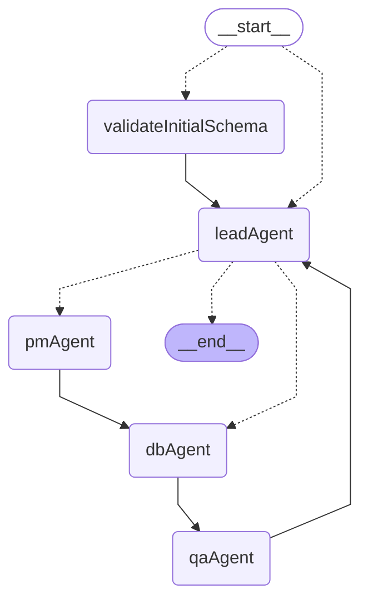
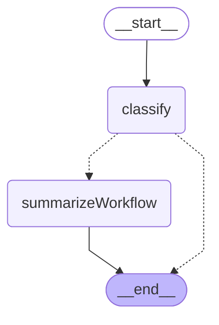
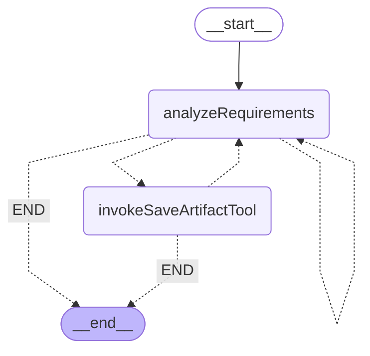
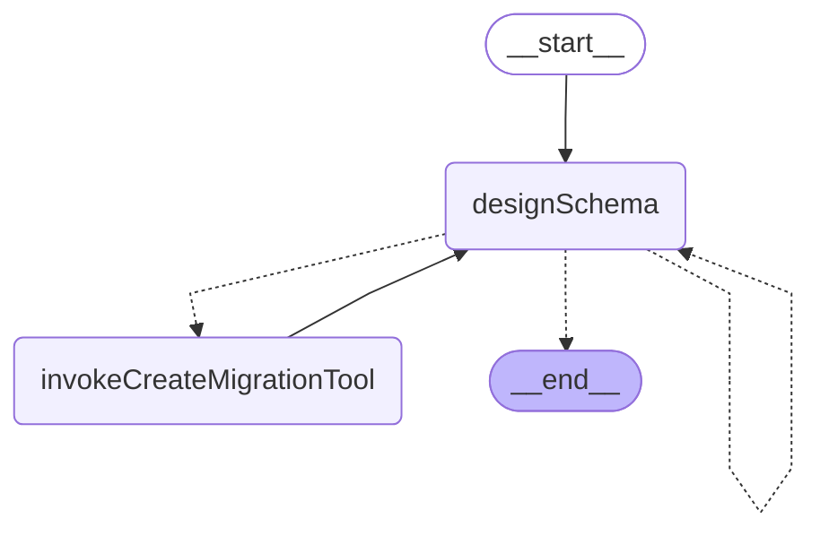
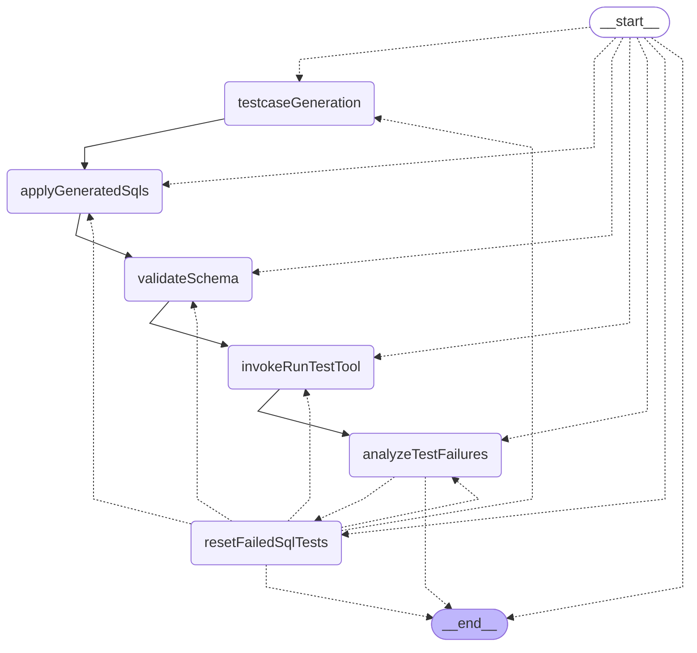
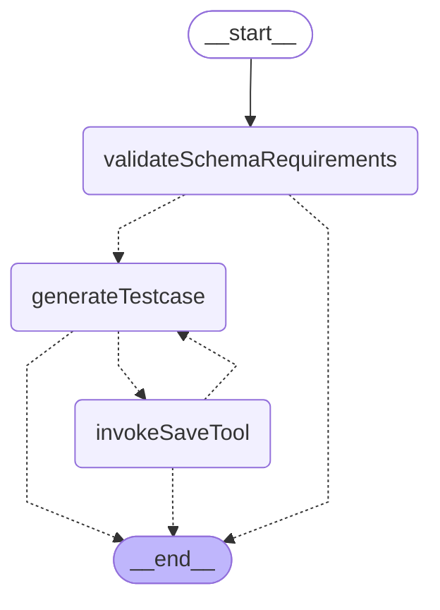

# LangGraph Chat Workflow

A **LangGraph implementation** for processing chat messages in the LIAM application, providing structured workflow management.

## Architecture



## Workflow State

```typescript
interface WorkflowState {
  userInput: string;
  messages: BaseMessage[];
  schemaData: Schema;
  error?: Error;
  buildingSchemaId: string;
  organizationId: string;
  userId: string;
  designSessionId: string;

  // Requirements analysis
  analyzedRequirements?: AnalyzedRequirements;
  testcases: Testcase[];
}
```

## Key Features

- **Conditional Routing**: Smart error handling with dynamic routing based on state
- **State Management**: Type-safe state transitions with LangGraph's annotation system
- **Error Handling**: Structured error handling with graceful failure paths
- **Retry Policy**: All nodes are configured with retry policy (maxAttempts: 3)
- **Fallback Mechanism**: Automatic fallback to finalizeArtifacts on critical errors
- **Real-time Progress Tracking**: Users can view AI responses in real-time during workflow execution
- **Optimized Memory Usage**: No intermediate state storage for generated responses

## Nodes

0. **validateInitialSchema**: Initial schema validation node that validates user-provided schema from initial_schema_snapshot using PostgreSQL deparser and PGLite execution - provides Instant Database initialization experience and terminates workflow on validation errors
1. **leadAgent**: Lead Agent subgraph that routes requests to appropriate specialized agents
2. **pmAgent**: PM Agent subgraph that handles requirements analysis - contains analyzeRequirements and invokeSaveArtifactTool nodes
3. **dbAgent**: DB Agent subgraph that handles database schema design - contains designSchema and invokeCreateMigrationTool nodes (performed by dbAgent)
4. **qaAgent**: QA Agent subgraph that handles testing and validation - contains testcaseGeneration (map-reduce) and validateSchema nodes
5. **leadAgent (summarize)**: When QA completes, Lead Agent summarizes the workflow by generating a comprehensive summary

## Lead Agent Subgraph

The `leadAgent` node is implemented as a **LangGraph subgraph** that acts as the intelligent router for incoming requests, determining which specialized agent should handle each task.

### Lead Agent Architecture



### Lead Agent Components

#### 1. classify Node

- **Purpose**: Analyzes user requests and determines appropriate routing
- **Performed by**: GPT-5-nano with specialized routing logic
- **Retry Policy**: maxAttempts: 3 (internal to subgraph)
- **Decision Making**: Uses Command-based routing for direct control flow
- **Routing**: Routes to pmAgent for database design tasks or summarizeWorkflow after QA completion

#### 2. summarizeWorkflow Node

- **Purpose**: Generates workflow summary after QA completion
- **Performed by**: GPT-5-nano with minimal reasoning
- **Activation**: Triggered when QA Agent has generated use cases

### Lead Agent Flow Patterns

1. **Database Design Request**: `START → classify → END` (routes to pmAgent via Command)
2. **Non-Database Request**: `START → classify → END` (responds directly without routing)
3. **Workflow Summarization**: `START → classify → summarizeWorkflow → END` (after QA completion)

### Lead Agent Benefits

- **🎯 Intelligent Routing**: Context-aware decision making for request classification
- **⚡ Fast Classification**: Uses GPT-5-nano for quick routing decisions
- **🔄 Extensible**: Easy to add new agent targets as system grows
- **🏗️ Clean Separation**: Routing logic isolated from business logic

## PM Agent Subgraph

The `pmAgent` node is implemented as a **LangGraph subgraph** that encapsulates all requirements analysis and artifact management logic as an independent, reusable component following multi-agent system best practices.

### PM Agent Architecture



### PM Agent Components

#### 1. analyzeRequirements Node

- **Purpose**: Analyzes and structures user requirements into BRDs
- **Performed by**: PM Analysis Agent with GPT-5
- **Retry Policy**: maxAttempts: 3 (internal to subgraph)

#### 2. invokeSaveArtifactTool Node

- **Purpose**: Processes and streams analyzed requirements to the frontend
- **Performed by**: processAnalyzedRequirementsTool
- **Retry Policy**: maxAttempts: 3 (internal to subgraph)
- **Tool Integration**: Normalizes LLM output and dispatches streaming events for real-time UI updates

### PM Agent Flow Patterns

1. **Simple Analysis**: `START → analyzeRequirements → END` (when requirements are fully analyzed)
2. **Iterative Saving**: `START → analyzeRequirements → invokeSaveArtifactTool → analyzeRequirements → ... → END`

## DB Agent Subgraph

The `dbAgent` node is implemented as a **LangGraph subgraph** that encapsulates all database schema design logic as an independent, reusable component following multi-agent system best practices.

### Subgraph Architecture



### Subgraph Components

#### 1. designSchema Node

- **Purpose**: Uses AI to design database schema based on requirements
- **Performed by**: dbAgent (Database Schema Build Agent)
- **Retry Policy**: maxAttempts: 3 (internal to subgraph)

#### 2. invokeCreateMigrationTool Node

- **Purpose**: Executes schema design tools to apply changes to the database
- **Performed by**: createMigrationTool
- **Retry Policy**: maxAttempts: 3 (internal to subgraph)
- **Tool Integration**: Direct database schema modifications

### Subgraph Flow Patterns

1. **Successful Design**: `START → designSchema → invokeCreateMigrationTool → END`
2. **Retry on Error**: `START → designSchema → invokeCreateMigrationTool → designSchema → invokeCreateMigrationTool → END`
3. **Retry on No Tool Call**: `START → designSchema → designSchema (retry) → invokeCreateMigrationTool → END`

### Subgraph Benefits

- **🔄 Reusability**: Can be used across multiple workflows (executeDesignProcess, deep modeling)
- **🧪 Independent Testing**: Dedicated test suite for DB Agent logic (`createDbAgentGraph.test.ts`)
- **🏗️ Separation of Concerns**: Database design logic isolated from main workflow
- **⚡ Optimized Retry Strategy**: Internal retry policy prevents double-retry scenarios
- **📊 Encapsulated State**: Self-contained error handling and state management

### Integration

The DB Agent subgraph is integrated into the main workflow as:

```typescript
import { createDbAgentGraph } from "./db-agent/createDbAgentGraph";

const dbAgentSubgraph = createDbAgentGraph();
graph.addNode("dbAgent", dbAgentSubgraph); // No retry policy - handled internally
```

## QA Agent Subgraph

The `qaAgent` node is implemented as a **LangGraph subgraph** that encapsulates all testing and validation logic as an independent, reusable component following multi-agent system best practices.

### QA Agent Architecture



### QA Agent Components

#### 1. testcaseGeneration Node

- **Purpose**: Implements map-reduce pattern for parallel testcase generation using a dedicated subgraph
- **Performed by**: Multiple parallel instances of testcase generation subgraph
- **Retry Policy**: maxAttempts: 3 (internal to subgraph)
- **Output**: AI-generated test cases with DML operations using tool calls

#### 2. applyGeneratedSqls Node

- **Purpose**: Maps generated SQLs from testcaseGeneration to analyzedRequirements.testcases
- **Performed by**: applyGeneratedSqlsNode function
- **Output**: Updates analyzedRequirements state with generated SQL for each testcase

**Testcase Generation Subgraph Architecture:**



**Subgraph Components:**
- **validateSchemaRequirements**: Pre-validation node that checks if schema can fulfill requirements before test generation
- **generateTestcase**: Generates test cases and DML operations using GPT-5-nano with specialized prompts
- **invokeSaveTool**: Executes saveTestcaseTool to persist generated test cases with DML operations

#### 3. validateSchemaRequirements Node

- **Purpose**: Pre-validation node that checks if schema can fulfill requirements before test generation
- **Performed by**: Schema validation logic with requirement analysis
- **Retry Policy**: maxAttempts: 3 (internal to testcaseGeneration subgraph)
- **Decision Making**: Routes to generateTestcase if sufficient, or END if schema is insufficient

#### 4. generateTestcase Node

- **Purpose**: Generates test cases and DML operations for a single requirement
- **Performed by**: GPT-5-nano with specialized test case generation prompts
- **Retry Policy**: maxAttempts: 3 (internal to testcaseGeneration subgraph)
- **Tool Integration**: Uses saveTestcaseTool for structured test case output

#### 5. invokeSaveTool Node

- **Purpose**: Executes saveTestcaseTool to persist generated test cases
- **Performed by**: ToolNode with saveTestcaseTool
- **Retry Policy**: maxAttempts: 3 (internal to testcaseGeneration subgraph)
- **Output**: Saves test cases with DML operations to workflow state

#### 6. validateSchema Node

- **Purpose**: Creates AI message to trigger test execution for schema validation
- **Performed by**: validateSchemaNode function
- **Retry Policy**: maxAttempts: 3 (internal to subgraph)
- **Output**: Generates tool call for runTestTool execution

#### 7. invokeRunTestTool Node

- **Purpose**: Executes DML statements and validates schema functionality
- **Performed by**: ToolNode with runTestTool
- **Retry Policy**: maxAttempts: 3 (internal to subgraph)
- **Validation**: Schema integrity and DML execution results

#### 8. analyzeTestFailures Node

- **Purpose**: Analyzes test execution results and identifies failed tests for retry
- **Performed by**: analyzeTestFailuresNode function
- **Output**: Sets `failureAnalysis` with `failedSqlTestIds` and `failedSchemaTestIds` arrays
- **Routing**: Routes to `resetFailedSqlTests` if failures exist, otherwise to `END`

#### 9. resetFailedSqlTests Node

- **Purpose**: Resets SQL fields for failed tests to enable regeneration
- **Performed by**: resetFailedSqlTestsNode function
- **Retry Logic**: Clears SQL for failed tests, allowing testcaseGeneration to regenerate with failure feedback
- **Max Retries**: Stops after 3 retry attempts per test (checked by routeAfterAnalyzeFailures)

### QA Agent Flow Patterns

1. **Initial Flow**: `START → testcaseGeneration (parallel) → applyGeneratedSqls → validateSchema → invokeRunTestTool → analyzeTestFailures`
2. **Retry Flow**: `analyzeTestFailures → resetFailedSqlTests → testcaseGeneration (parallel) → ... → analyzeTestFailures` (up to 3 retry attempts)
3. **Success Flow**: `analyzeTestFailures → END` (when all tests pass or max retries reached)
4. **Parallel Processing**: Multiple testcase generation instances run concurrently
5. **SQL Mapping**: Generated SQLs are mapped to analyzedRequirements.testcases before validation
6. **Split Validation**: Test case generation and execution are now separated - generation creates test cases, then validation triggers test execution via the new runTestTool
7. **Auto-Recovery**: Failed SQL tests are automatically regenerated with failure feedback up to 3 times

### QA Agent Benefits

- **🔄 Reusability**: Can be used across multiple workflows requiring schema validation
- **🧪 Independent Testing**: Dedicated test suite for QA Agent logic (`createQaAgentGraph.test.ts`)
- **🏗️ Separation of Concerns**: Testing and validation logic isolated from main workflow
- **⚡ Optimized Retry Strategy**: Internal retry policy prevents double-retry scenarios
- **📊 Encapsulated State**: Self-contained error handling and state management
- **🎯 Focused Testing**: Linear flow ensures comprehensive schema validation

### Integration

The QA Agent subgraph is integrated into the main workflow as:

```typescript
import { createQaAgentGraph } from "./qa-agent/createQaAgentGraph";

const qaAgentSubgraph = createQaAgentGraph();
graph.addNode("qaAgent", qaAgentSubgraph); // No retry policy - handled internally
```


### Conditional Edge Logic

- **analyzeRequirements**: Routes to `saveRequirementToArtifact` when requirements are successfully analyzed, retries `analyzeRequirements` with retry count tracking (max 3 attempts), fallback to `finalizeArtifacts` when max retries exceeded
- **saveRequirementToArtifact**: Always routes to `dbAgent` after processing artifacts (workflow termination node pattern)
- **dbAgent**: DB Agent subgraph handles internal routing between designSchema and invokeCreateMigrationTool nodes, routes to `qaAgent` on completion
- **qaAgent**: QA Agent subgraph handles internal routing between generateTestcase, generateDml, invokeSaveDmlTool, and validateSchema nodes, always routes to `finalizeArtifacts`


## Usage

```typescript
import { deepModeling } from "./deepModeling";

const result = await deepModeling(
  {
    userInput:
      "Create a schema for a fitness tracking app with users, workout plans, exercise logs, and progress charts.",
    schemaData: mySchemaData,
    organizationId: "my-organization-id",
    buildingSchemaId: "my-building-schema-id",
    userId: "my-user-id",
    designSessionId: "my-design-session-id",
  },
  {
    configurable: {
      repositories,
      logger,
    },
  }
);
```
