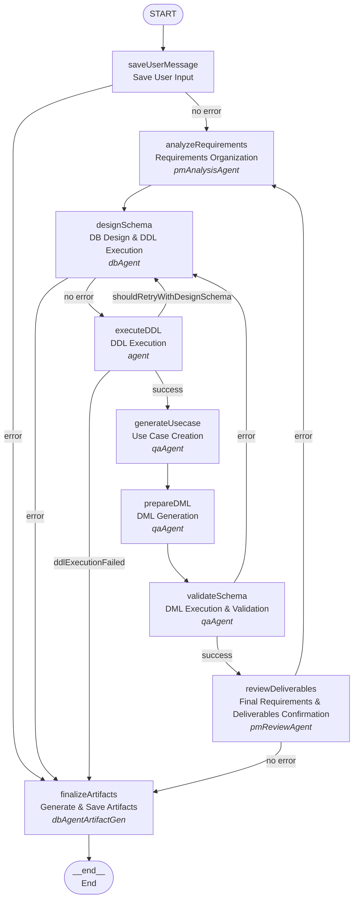

# LangGraph Chat Workflow

A **LangGraph implementation** for processing chat messages in the LIAM application, providing structured workflow management.

## Architecture



## Workflow State

```typescript
interface WorkflowState {
  userInput: string;
  messages: BaseMessage[];
  schemaData: Schema;
  error?: Error;
  buildingSchemaId: string;
  latestVersionNumber: number;
  organizationId?: string;
  userId: string;
  designSessionId: string;
  retryCount: Record<string, number>;

  // Requirements analysis
  analyzedRequirements?: AnalyzedRequirements;
  generatedUsecases?: Usecase[];

  // DDL/DML execution
  ddlStatements?: string;
  dmlStatements?: string;
  shouldRetryWithDesignSchema?: boolean;
  ddlExecutionFailed?: boolean;
  ddlExecutionFailureReason?: string;

  // DML execution results
  dmlExecutionSuccessful?: boolean;
  dmlExecutionErrors?: string;
}
```

## Key Features

- **Conditional Routing**: Smart error handling with dynamic routing based on state
- **State Management**: Type-safe state transitions with LangGraph's annotation system
- **Error Handling**: Structured error handling with graceful failure paths
- **Retry Policy**: All nodes are configured with retry policy (maxAttempts: 3)
- **Fallback Mechanism**: Automatic fallback to finalizeArtifacts on critical errors
- **Direct Timeline Storage**: Responses are saved directly to timeline_items database table
- **Optimized Memory Usage**: No intermediate state storage for generated responses

## Nodes

1. **saveUserMessage**: Saves user input and prepares initial state
2. **analyzeRequirements**: Organizes and clarifies requirements from user input (performed by pmAnalysisAgent)
3. **designSchema**: Designs database schema and saves responses directly to timeline_items (performed by dbAgent)
4. **executeDDL**: Executes DDL statements (performed by agent)
5. **generateUsecase**: Creates use cases for testing (performed by qaAgent)
6. **prepareDML**: Generates DML statements for testing (performed by qaAgent)
7. **validateSchema**: Executes DML and validates schema (performed by qaAgent)
8. **reviewDeliverables**: Performs final confirmation of requirements and deliverables (performed by pmReviewAgent)
9. **finalizeArtifacts**: Generates and saves comprehensive artifacts to database, handles error timeline items (performed by dbAgentArtifactGen)

### Conditional Edge Logic

- **saveUserMessage**: Routes to `analyzeRequirements` on success, `finalizeArtifacts` on error
- **designSchema**: Routes to `executeDDL` on success, `finalizeArtifacts` on error
- **executeDDL**: Routes to `generateUsecase` on success, `designSchema` if retry needed, `finalizeArtifacts` if failed
- **validateSchema**: Routes to `reviewDeliverables` on success, `designSchema` on validation error
- **reviewDeliverables**: Routes to `finalizeArtifacts` on success, `analyzeRequirements` if issues found

## Optimization Features

### Direct Timeline Storage

- **Immediate Response Storage**: Generated responses are saved directly to the `timeline_items` table when created in `designSchemaNode`
- **No State Bloat**: Responses are not stored in workflow state to reduce memory usage
- **Database-Centric**: Frontend reads responses directly from the database rather than from workflow return values

### Simplified Return Values

- **Success Indicator Only**: The `deepModeling` function returns only `{ success: true }` or an error
- **No Response Text**: The actual response text is not returned, as it's stored in the database
- **Error Handling**: Only errors are propagated through the workflow return values

### Memory Optimization

- **Removed Fields**: `generatedAnswer` and `finalResponse` have been removed from state
- **Direct API Calls**: Timeline items are saved using `repositories.schema.createTimelineItem()` directly
- **Reduced Serialization**: Less data to serialize/deserialize in workflow state transitions

## Usage

```typescript
import { deepModeling } from "./deepModeling";

const result = await deepModeling(
  {
    userInput:
      "Create a schema for a fitness tracking app with users, workout plans, exercise logs, and progress charts.",
    history: [],
    schemaData: mySchemaData,
    organizationId: "my-organization-id",
    buildingSchemaId: "my-building-schema-id",
    latestVersionNumber: 1,
    userId: "my-user-id",
    designSessionId: "my-design-session-id",
  },
  {
    configurable: {
      repositories,
      logger,
    },
  }
);

// Result is { success: true } on success, or Error on failure
// Actual responses are stored in timeline_items table and read by frontend
// The workflow is typically run as a background job via Trigger.dev
```
