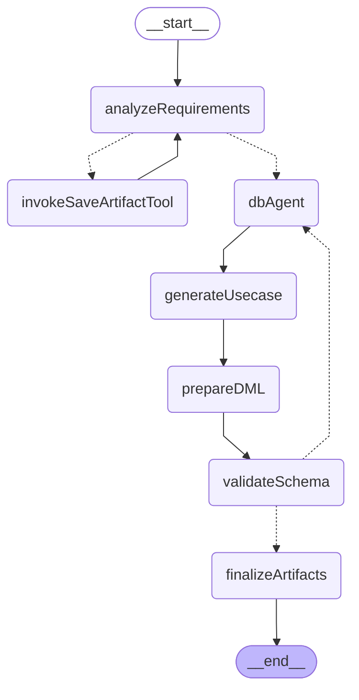

# LangGraph Chat Workflow

A **LangGraph implementation** for processing chat messages in the LIAM application, providing structured workflow management.

## Architecture



## Workflow State

```typescript
interface WorkflowState {
  userInput: string;
  messages: BaseMessage[];
  schemaData: Schema;
  error?: Error;
  buildingSchemaId: string;
  latestVersionNumber: number;
  organizationId: string;
  userId: string;
  designSessionId: string;
  retryCount: Record<string, number>;

  // Requirements analysis
  analyzedRequirements?: AnalyzedRequirements;
  generatedUsecases?: Usecase[];

  // DDL/DML execution
  ddlStatements?: string;
  dmlStatements?: string;
  shouldRetryWithDesignSchema?: boolean;
  ddlExecutionFailed?: boolean;
  ddlExecutionFailureReason?: string;

  // DML execution results
  dmlExecutionSuccessful?: boolean;
  dmlExecutionErrors?: string;
}
```

## Key Features

- **Conditional Routing**: Smart error handling with dynamic routing based on state
- **State Management**: Type-safe state transitions with LangGraph's annotation system
- **Error Handling**: Structured error handling with graceful failure paths
- **Retry Policy**: All nodes are configured with retry policy (maxAttempts: 3)
- **Fallback Mechanism**: Automatic fallback to finalizeArtifacts on critical errors
- **Automatic Timeline Sync**: All AI messages and user messages are automatically synchronized to timeline_items using `withTimelineItemSync` utility
- **Real-time Progress Tracking**: Users can view AI responses in real-time during workflow execution
- **Optimized Memory Usage**: No intermediate state storage for generated responses

## Nodes

1. **analyzeRequirements**: Organizes and clarifies requirements from user input (performed by pmAnalysisAgent)
2. **saveRequirementToArtifact**: Processes analyzed requirements, saves artifacts to database, and syncs timeline (performed by pmAgent)
3. **dbAgent**: DB Agent subgraph that handles database schema design - contains designSchema and invokeSchemaDesignTool nodes (performed by dbAgent)
4. **generateUsecase**: Creates use cases for testing with automatic timeline sync (performed by qaAgent)
5. **prepareDML**: Generates DML statements for testing (performed by qaAgent)
6. **validateSchema**: Executes DML and validates schema (performed by qaAgent)
7. **finalizeArtifacts**: Generates and saves comprehensive artifacts to database, handles error timeline items (performed by dbAgentArtifactGen)

## DB Agent Subgraph

The `dbAgent` node is implemented as a **LangGraph subgraph** that encapsulates all database schema design logic as an independent, reusable component following multi-agent system best practices.

### Subgraph Architecture


### Subgraph Components

#### 1. designSchema Node
- **Purpose**: Uses AI to design database schema based on requirements
- **Performed by**: dbAgent (Database Schema Build Agent)
- **Retry Policy**: maxAttempts: 3 (internal to subgraph)
- **Timeline Sync**: Automatic message synchronization

#### 2. invokeSchemaDesignTool Node
- **Purpose**: Executes schema design tools to apply changes to the database
- **Performed by**: schemaDesignTool
- **Retry Policy**: maxAttempts: 3 (internal to subgraph)
- **Tool Integration**: Direct database schema modifications

### Subgraph Flow Patterns

1. **Simple Design**: `START → designSchema → END` (when no tool calls needed)
2. **Iterative Design**: `START → designSchema → invokeSchemaDesignTool → designSchema → ... → END`

### Subgraph Benefits

- **🔄 Reusability**: Can be used across multiple workflows (executeDesignProcess, deep modeling)
- **🧪 Independent Testing**: Dedicated test suite for DB Agent logic (`createDbAgentGraph.test.ts`)
- **🏗️ Separation of Concerns**: Database design logic isolated from main workflow
- **⚡ Optimized Retry Strategy**: Internal retry policy prevents double-retry scenarios
- **📊 Encapsulated State**: Self-contained error handling and state management

### Integration

The DB Agent subgraph is integrated into the main workflow as:

```typescript
import { createDbAgentGraph } from './db-agent/createDbAgentGraph'

const dbAgentSubgraph = createDbAgentGraph()
graph.addNode('dbAgent', dbAgentSubgraph) // No retry policy - handled internally
```

### Conditional Edge Logic

- **analyzeRequirements**: Routes to `saveRequirementToArtifact` when requirements are successfully analyzed, retries `analyzeRequirements` with retry count tracking (max 3 attempts), fallback to `finalizeArtifacts` when max retries exceeded
- **saveRequirementToArtifact**: Always routes to `dbAgent` after processing artifacts (workflow termination node pattern)
- **dbAgent**: DB Agent subgraph handles internal routing between designSchema and invokeSchemaDesignTool nodes, routes to `generateUsecase` on completion
- **validateSchema**: Routes to `finalizeArtifacts` on success, `dbAgent` on validation error

## Timeline Synchronization

### Automatic Message Sync with `withTimelineItemSync`

- **Universal Integration**: All AIMessage and HumanMessage instances are automatically synchronized to timeline_items
- **Real-time Updates**: Messages appear in the UI immediately when created during workflow execution
- **Type-appropriate Storage**: 
  - User messages → `type: 'user'`
  - AI responses → `type: 'assistant'` (main conversation messages with timestamps)
  - Progress logs → `type: 'assistant_log'` (intermediate status updates without timestamps)
- **Role Assignment**: Automatic assistant role assignment (`db`, `pm`, `qa`) based on workflow node context
- **Error Resilience**: Timeline sync failures are logged but don't interrupt workflow execution

### Implementation Details

- **User Message Sync**: User input is synchronized in `deepModeling.ts` before workflow execution
- **AI Message Sync**: All workflow nodes (analyzeRequirements, dbAgent subgraph, generateUsecase) automatically sync their AI responses
- **Non-blocking**: Timeline synchronization is asynchronous and non-blocking to ensure workflow performance
- **Utility Function**: `withTimelineItemSync()` provides consistent message synchronization across all nodes

### Memory Optimization

- **No State Bloat**: Messages are not duplicated in workflow state after timeline synchronization
- **Database-Centric**: Frontend reads messages directly from timeline_items table
- **Reduced Serialization**: Less data to serialize/deserialize in workflow state transitions

## Usage

```typescript
import { deepModeling } from "./deepModeling";

const result = await deepModeling(
  {
    userInput:
      "Create a schema for a fitness tracking app with users, workout plans, exercise logs, and progress charts.",
    history: [],
    schemaData: mySchemaData,
    organizationId: "my-organization-id",
    buildingSchemaId: "my-building-schema-id",
    latestVersionNumber: 1,
    userId: "my-user-id",
    designSessionId: "my-design-session-id",
  },
  {
    configurable: {
      repositories,
      logger,
    },
  }
);

// Result is { success: true } on success, or Error on failure
// All user and AI messages are automatically synchronized to timeline_items table
// Frontend receives real-time updates as workflow progresses
// The workflow is typically run as a background job via Trigger.dev
```
