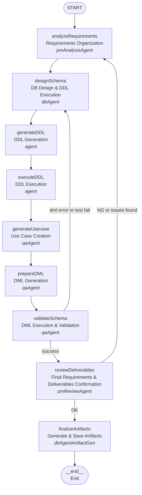

# LangGraph Chat Workflow

A **LangGraph implementation** for processing chat messages in the LIAM application, providing structured workflow management.

## Architecture



## Workflow State

```typescript
interface WorkflowState {
  userInput: string
  generatedAnswer?: string
  finalResponse?: string
  history: string[]
  schemaData: Schema
  projectId?: string
  error?: string
  buildingSchemaId: string
  latestVersionNumber?: number
  organizationId?: string
  userId: string
  designSessionId: string
  repositories: Repositories
}
```

## Key Features

- **Conditional Routing**: Smart error handling with dynamic routing based on state
- **State Management**: Type-safe state transitions with LangGraph's annotation system
- **Error Handling**: Structured error handling with graceful failure paths

## Nodes

1. **analyzeRequirements**: Organizes and clarifies requirements from user input (performed by pmAnalysisAgent)
2. **designSchema**: Designs database schema and executes DDL statements (performed by dbAgent)
3. **generateDDL**: Generates DDL statements (performed by agent)
4. **executeDDL**: Executes DDL statements (performed by agent)
5. **generateUsecase**: Creates use cases for testing (performed by qaAgent)
6. **prepareDML**: Generates DML statements for testing (performed by qaAgent)
7. **validateSchema**: Executes DML and validates schema (performed by qaAgent)
8. **reviewDeliverables**: Performs final confirmation of requirements and deliverables (performed by pmReviewAgent)
9. **finalizeArtifacts**: Generates and saves comprehensive artifacts to database (performed by dbAgentArtifactGen)

## Usage

```typescript
import { executeChatWorkflow } from './workflow'

const result = await executeChatWorkflow({
  userInput: 'Create a schema for a fitness tracking app with users, workout plans, exercise logs, and progress charts.',
  history: [],
  schemaData: mySchemaData,
  organizationId: 'my-organization-id',
  buildingSchemaId: 'my-building-schema-id',
  latestVersionNumber: 1,
  userId: 'my-user-id',
  designSessionId: 'my-design-session-id',
  repositories: myRepositories,
})
```
